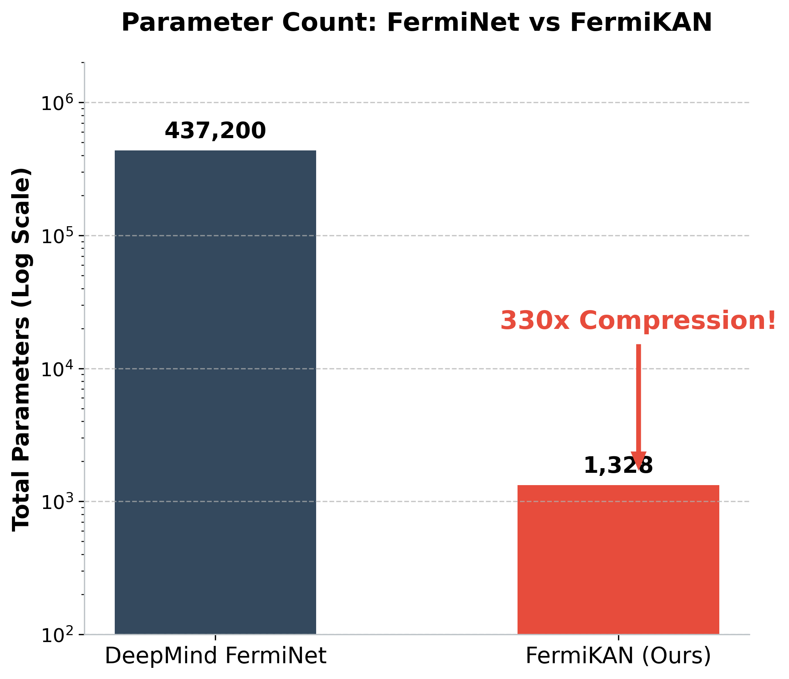

# FermiKAN: Physics-Designed Kolmogorov-Arnold Networks for Neural QMC


[](https://doi.org/10.5281/zenodo.21849868)

## Overview
**FermiKAN** is a Neural Quantum Monte Carlo (Neural QMC) architecture that applies the **PD-KAN (Physics-Designed Kolmogorov-Arnold Networks)** framework. 
By mapping physical coordinates into smooth geometric manifolds and embedding learnable basis sets (LCAO) via KANs, it achieves massive parameter compression (~330x smaller than the baseline FermiNet for H2) while enabling "Glass-Box" mechanistic interpretability of the learned quantum states.



The framework establishes a universal, two-step architectural paradigm:
1. **Geometric Manifold Mapping**: Analytically mapping the physical coordinates into an intrinsically smooth geometric manifold.
2. **Adaptive KAN Residuals**: Deploying Kolmogorov-Arnold Networks (KAN) on this smooth manifold to learn the true, underlying physical correlations.

## 🚀 Quick Start & Installation

For a detailed walkthrough on setting up the JAX environment (Apptainer/Conda) and running the experiments, please refer to our comprehensive guide:

👉 **[Read the Full Installation & Usage Manual (manual.md)](manual.md)**

### Basic Usage
```bash
# Activate the environment
micromamba activate fermikan

# Run the H2 dissociation PoC
python run_pdkan_ferminet.py
```

## 📚 Documentation & Physics Reports

FermiKAN is designed not just for computational efficiency, but for **XAI (Explainable AI) in Physics**. 
To read about our architectural design, optimization journeys, and the "Bitter Lesson" of Neural QMC symmetry breaking, please explore the following articles:

- [**The Architectural Whitepaper** (Hashnode)](https://samu-physicist.hashnode.dev/tpu-friendly-kolmogorov-arnold-networks-for-neural-qmc-a-330x-compression-of-ferminet-using-jax) - *A comprehensive guide to the theoretical foundations, geometric manifold embeddings, and how we achieved 330x parameter compression and faced "The Bitter Lesson".*
- [**The Optimization Journey & Physics Report**](articles/physics_report.md) - *Read how FermiKAN autonomously rediscovers Restricted Hartree-Fock (RHF) covalent bonds from isolated atoms.*

While demonstrated here on many-body quantum mechanics, this PD-KAN paradigm is universally applicable to general Physics-Informed Machine Learning (PINNs) and PDE solvers (e.g., Fluid Dynamics, FEM). By using analytical transformations to resolve boundary conditions or singularities, KANs can efficiently learn the complex residual dynamics in any physical system.

## ⚠️ Known Issues
- **K-FAC Optimizer**: The official K-FAC optimizer in the upstream FermiNet repository is currently broken under recent JAX/XLA updates. We currently rely on Adam (first-order), which requires ~10,000 iterations to cross symmetry-breaking energy plateaus. Revival of K-FAC is an absolute necessity for scaling to larger systems (e.g., Benzene). PRs and JAX/XLA wizards are highly welcome!
- **Initialization Plateau**: The `StochasticHomeAtomInitializer` safely pre-allocates electrons into their neutral atom ground-state shells. This creates a safe but localized initial state, leading to an "Activation Energy" plateau due to near-zero initial orbital overlap between isolated atoms.

## Repository Structure
- `ferminet/` : Modified JAX codebase integrating the PD-KAN architecture.
- `articles/` : Drafts and explanatory articles regarding the architecture and methodology.
- `pdkan_Dev.py` / `run_pdkan_ferminet.py` : Core FermiKAN network definition and execution scripts.

---

## Acknowledgements
This project is heavily inspired by and builds upon the foundational work of FermiNet by Google DeepMind (Pfau et al., 2020) and the KAN authors (Ziming Liu et al., 2024).

## References
1. Pfau, D., Spencer, J. S., Matthews, A. G. D. G., & Foulkes, W. M. C. (2020). Ab initio solution of the many-electron Schrödinger equation with deep neural networks. *Physical Review Research*, 2(3), 033429.
2. Liu, Z., Wang, Y., Vaidya, S., Ruehle, F., Halverson, J., Soljačić, M., ... & Tegmark, M. (2024). KAN: Kolmogorov-Arnold Networks. *arXiv preprint arXiv:2404.19756*.
3. Kato, T. (1957). On the eigenfunctions of many-particle systems in quantum mechanics. *Communications on Pure and Applied Mathematics*, 10(2), 151-177.

## Citation
If you use the PD-KAN framework or this codebase in your research, please cite our Zenodo release:

```bibtex
@software{takamatsu_2026_fermikan,
  author       = {Takamatsu, Tomoaki},
  title        = {{FermiKAN: Physics-Designed Kolmogorov-Arnold Networks for Neural QMC}},
  month        = aug,
  year         = 2026,
  publisher    = {Zenodo},
  version      = {v0.1.0-alpha},
  doi          = {10.5281/zenodo.21849868},
  url          = {https://doi.org/10.5281/zenodo.21849868}
}
```
