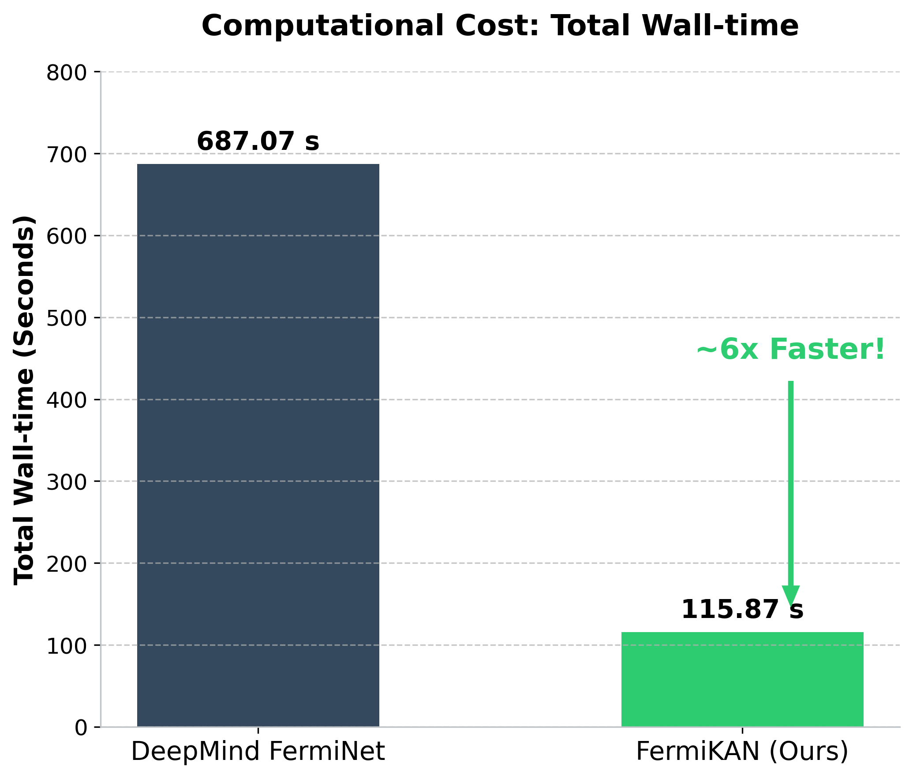
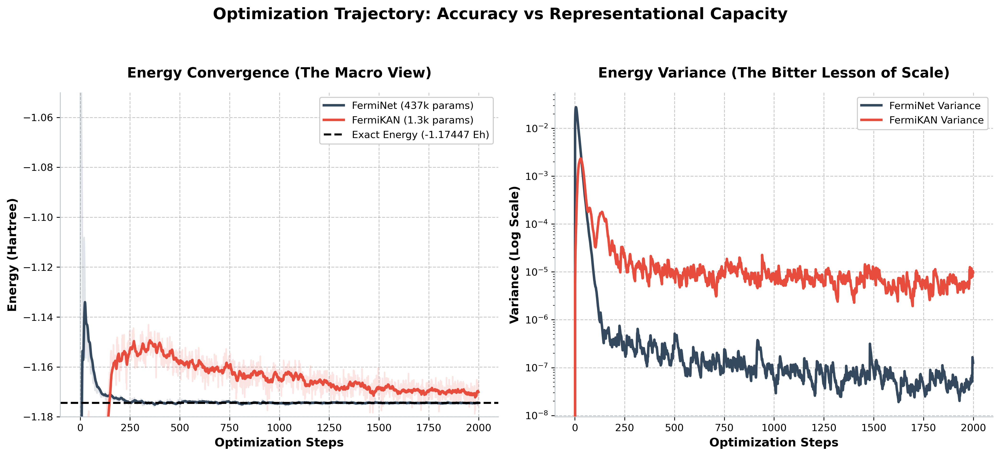

# TPU-Friendly Kolmogorov-Arnold Networks for Neural QMC: A 330x Compression of FermiNet Using JAX
## How leveraging JAX (jnp.einsum and lax.scan) transformed branching KAN architectures into TPU-friendly dense GEMMs, unlocking "Glass-Box" interpretability.

**[TL;DR] What if you could run Kolmogorov-Arnold Networks (KANs) efficiently on TPUs without suffering from memory fragmentation and conditional branching?**

Note for ML Engineers: While this project tackles Quantum Chemistry, you don't need a PhD in physics to read this. The core of this article is a deep dive into JAX software architecture—specifically, how to refactor branching algorithms into TPU-friendly dense GEMMs, and how to inject physical constraints (Inductive Biases) into neural networks.

In this project, we introduce Physics-Designed KAN (PD-KAN), a framework that pushes JAX to its limits to optimize Neural Quantum Monte Carlo (Neural QMC). By refactoring the KAN architecture specifically for Google's hardware ecosystem, we demonstrated:

- TPU-Friendly Vectorization: Replacing branching B-splines with orthogonal polynomials, fully vectorized via JAX's jnp.einsum and lax.scan to create pure dense GEMM operations.
- 330x Parameter Compression: Integrating this JAX-native KAN into DeepMind's FermiNet, shrinking the architecture from 437,200 down to just 1,328 parameters for the H2 molecule (the "Hello World" of quantum chemistry).
- Numerical Stability: Eliminating the notorious $r \to 0$ origin singularity using a 4D epsilon-manifold mapping, preventing NaN explosions during optimization.
- AI-Empowered Engineering: As a solo industrial chemist, translating complex LCAO physics into TPU-optimized JAX code was achieved through extensive pair-programming and brainstorming with **Gemini**. This project serves as a real-world showcase of how AI coding assistants can exponentially amplify domain experts to push the boundaries of ML systems, especially in AI for Science.

> 💻 **Code Availability**: The complete JAX implementation, including `environment.yml` and `Apptainer.def` for easy replication, is open-sourced on GitHub: **[Samu-Physicist/FermiKAN](https://github.com/Samu-Physicist/FermiKAN)**


How did we do it? To understand *why* we needed JAX's powerful vectorization to optimize these KANs, we first have to understand the fundamental mathematical bottleneck we were trying to solve. Let’s dive into the geometry that set the stage (Sections 1-2), and then see how it translates into TPU-friendly JAX code (Sections 3-4).

---

## 1. Introduction: The Origin Singularity in Continuous 3D Spaces

In the rapidly evolving landscape of 3D deep learning, extracting features from continuous fields—like electron wavefunctions or fluid dynamics—often leads to a fatal numerical trap: **the Origin Singularity**. When a particle approaches a central node (e.g., $r \to 0$), distance-based features like $1/r$ or normalized vectors $\vec{r}/|\vec{r}|$ blow up, unleashing infinite gradients (NaNs) that instantly destroy the optimizer. Frameworks like `e3nn` solve this for discrete nodes, but in continuous space, this singularity is a persistent nightmare.

So, why not just feed raw Cartesian coordinates $(x, y, z)$ into a standard Multi-Layer Perceptron (MLP) or a Kolmogorov-Arnold Network (KAN)? 

Here lies the fundamental trap: **The Origin Singularity** and **the Curse of Divergence**.
If we try to extract angular dependencies directly from Cartesian inputs, we inevitably face a division-by-zero singularity at the origin ($r \to 0$). On the other extreme, standard polynomial representations (like solid harmonics) couple the radial distance with the angles. As the distance from the origin increases, these $x^l, y^l, z^l$ polynomials blow up to infinity, destroying the Lipschitz continuity of the network and causing massive gradient instability. 

We need a canvas that is smooth, free of singularities, and decouples the radial and angular components.

---

## 2. The Idea: epsilon-Manifold Embedding

How do we eliminate a 3D singularity? By stepping into a higher dimension. 

Instead of dealing with the precarious 3D Cartesian space, we project our 3D directional vectors into a bounded 4D manifold using an **epsilon-regularization map**. In the realm of continuous neural fields, we can use this geometric elegance to bypass the origin singularity.

Let our spatial coordinate be defined by its radial distance $r$ and a 4D unit vector 

$q = \frac{1}{\sqrt{r^2+\epsilon^2}}(x,y,z,\epsilon)$.

The magic happens here: because the vector is strictly bound to a unit manifold, any polynomial learned by the network on this manifold is inherently bounded. It **never diverges**, no matter how far the particle is from the origin. 

Furthermore, mapping polynomials on this manifold naturally projects down to hybridizations of Solid Spherical Harmonics in 3D space. We have successfully decoupled the radial component $r$ from the pure, singularity-free angular canvas.

Now, we have the stable environment. The next question is: How do we construct a neural network that can natively and efficiently learn these hybridized angular bases? Enter the orthogonal-polynomial Kolmogorov-Arnold Network (KAN).

---

## 3. KAN on a Hypersphere: Hardware-Friendly Orthogonal Polynomials

Now that we have a stable 4D bounded canvas, we need a network to paint on it. The Kolmogorov-Arnold Network (KAN) is a natural fit, as it learns adaptive non-linear functions on its edges. However, there is a catch: the original KAN relies on B-splines. 

From a hardware perspective, B-splines are a bit unsuitable for Tensor Processing Units (TPUs). TPUs are built around systolic arrays designed for massive, dense matrix multiplications (GEMMs). B-splines require conditional branching and localized basis evaluations, which heavily fragment memory access and cripple hardware utilization.

To unlock hardware acceleration, we replace B-splines with **Orthogonal Polynomials** (such as Chebyshev or Legendre polynomials). 
Because orthogonal polynomials can be generated using simple recurrence relations, we can implement the entire KAN forward pass as a sequence of dense tensor contractions. By leveraging JAX's `jnp.einsum` for batched matrix multiplications and `lax.scan` for memory-efficient recurrence loops, we transform the KAN from a branching-heavy algorithm into a pure, TPU-friendly dense GEMM operation.

[Embed Gist Here]

## 4. The Stress Test: Standing on the Shoulders of FermiNet

To prove that this manifold-based architecture is not just a mathematical toy, we applied it to one of the most rigorously demanding tasks in AI: solving the Schrödinger equation via Neural Quantum Monte Carlo (Neural QMC). 

We did not build this from scratch. We integrated our architecture as an extension module into **FermiNet**, DeepMind's pioneering Neural QMC framework. FermiNet's robust infrastructure and advanced K-FAC optimizer provided an incredibly powerful ecosystem, allowing us to focus entirely on testing our architectural ideas at scale.

### The Physics-Designed KAN (PD-KAN)

The core strength of the Kolmogorov-Arnold Network (KAN) lies in its ability to learn non-linear functions on edges via a *Basis Expansion*. Typically, generic B-splines are used for this expansion. However, we injected a physical **Inductive Bias** into this mechanism.

Instead of generic splines, we adopted a Learnable Physical Basis (Adaptive LCAO) for our KAN edges. Unlike classical static orbitals, these basis functions are parameterized; both the LCAO coefficients and the underlying orbital shapes are dynamically optimized end-to-end via JAX's Autograd. Mathematically, it takes this form:

$$
\phi_k = \sum_{I \in \text{Atoms}} \sum_{(n, l) \in \text{Pool}} C_{k, I, n, l} \cdot \left[ R_{n, l}(|\mathbf{r}_{iI}|_{\text{shifted}}, \xi(\mathbf{h})) \right] \cdot \left( |\mathbf{r}_{iI}|_{\text{true}}^l \cdot \mathcal{P}_l(\mathbf{q}_{4D}) \right) \cdot \exp(\text{Envelope}(|\mathbf{r}_{iI}|_{\text{true}}))
$$

In the realm of quantum chemistry, this is known as Linear Combination of Atomic Orbitals (LCAO)—a classical and incredibly powerful technique. But translated into the context of modern Machine Learning, it is exactly this: **a KAN equipped with a Physics-Informed custom basis.**

Our core contribution to this ecosystem is the **Physics-Designed KAN (PD-KAN)**.
Typically, Neural QMC models require extensive pre-training to learn the fundamental shapes of atomic orbitals before the actual optimization can begin. PD-KAN eliminates this by adopting a strategic **Hybrid Initialization Paradigm**:
1. **Physics-Informed Parametric Residuals (Radial):** To strictly preserve the electron-nucleus cusp condition and numerical stability, the radial component is initialized with exact analytical solutions (Laguerre polynomials). The KAN is tasked with learning only the *parameter residual*—the dynamic shift in the effective nuclear charge $\Delta \xi(r, h)$ caused by electron screening.
2. **Unconstrained Hybridization (Angular):** While the radial component uses physical priors, the angular component starts from a neutral state ($W=0$). We do *not* hardcode spherical harmonics. Instead, the network is given raw Cartesian monomials and must learn to assemble the optimal polarized orbitals (e.g., $p_z$) and chemical hybridization purely through gradient descent.

By plugging PD-KAN into the FermiNet infrastructure, we achieve a zero-shot initialization paradigm. The network starts with a physically safe state at Step 0, bypassing the heavy pre-training phase entirely while retaining the architectural flexibility to learn optimal spatial symmetries dynamically.

**Putting It All Together: The PD-KAN Forward Pass**
To visualize how these hybrid mechanics operate in practice, here is the step-by-step data flow of the architecture:

1. **Dynamic Coordinate Shift (Vector Backflow)**
   - Raw electron/nuclei coordinates are fed into a Backflow-KAN to learn electron correlations, generating a dynamic shift $\eta_i$.
   - These effective coordinates are mapped to the 4D Epsilon-Manifold to prevent origin singularities.
   ```mermaid
   graph LR
       A["Raw Coordinates"] --> B["Backflow-KAN<br>(Shift η_i)"]
       B --> C["4D Epsilon-Manifold<br>Embedding"]
       style B fill:#f9f2f4,stroke:#333
       style C fill:#f9f2f4,stroke:#333
   ```
2. **Physical Basis Evaluation (PD-KAN)**
   - **Radial**: The scalar distance feeds into a Chebyshev KAN (handling static morphing and dynamic breathing), which outputs a dynamic parameter $\xi$. This parameter controls the exponential decay of Analytical Laguerre Polynomials, ensuring an exact electron-nucleus cusp.
   - **Angular**: The 4D embedding feeds into an Angular KAN, assembling Cartesian monomials with learnable weights (*Unbiased Initialization*).
   ```mermaid
   graph LR
       R["Distance"] --> C["Chebyshev KAN"] --> L["Laguerre Poly<br>× e^{-ξr}"]
       A["4D Embed"] --> K["Angular KAN"] --> M["Cartesian<br>Monomials"]
       style C fill:#e8f4f8,stroke:#333
       style K fill:#e8f4f8,stroke:#333
   ```
3. **LCAO Orbital Construction**
   - Radial and Angular outputs are combined and multiplied by LCAO coefficients.
   - Summing over all atoms and physical shells yields the generalized 1-Electron Orbital.
   ```mermaid
   graph LR
       R["Radial"] & A["Angular"] --> C["LCAO Coefficients"]
       C --> S["Sum over atoms/shells"] --> O(("Orbital φ_i"))
       style C fill:#f4f9e8,stroke:#333
   ```
4. **Slater-Jastrow Wavefunction**
   - The orbitals are passed through a Slater Determinant (guaranteeing physical antisymmetry).
   - Following the PauliNet architecture, the determinant is explicitly multiplied by a Jastrow factor (enforcing electron-electron cusps separately for parallel and anti-parallel spins) to produce the final continuous wavefunction.
   ```mermaid
   graph LR
       O["Orbitals"] --> S["Slater Determinant"]
       S --> J["× Jastrow Factor"] --> W(("Wavefunction Ψ"))
       style S fill:#fff3e6,stroke:#333
   ```

---

## 5. Results: Speed, Scale, and Bitter Lesson

To demonstrate the power of PD-KAN, I need to make a confession: I originally intended to run this on top of FermiNet using its notorious K-FAC optimizer. However, I encountered a severe "dependency hell" between the older JAX/XLA versions required by the official FermiNet repository and the cutting-edge JAX ecosystem utilized in this project. Due to these version incompatibilities, maintaining the intricate K-FAC hooks became insurmountable for a solo researcher, and I was forced to fall back to the standard, much lighter Adam optimizer.
What happened next was a serendipitous discovery.

**1. The Win: 330x Parameter Compression**
By forcing the network to learn within a physical S3 manifold rather than a massive unconstrained MLP, we drastically shrank the parameter space. The original FermiNet required 437,200 parameters for the H2 molecule. PD-KAN achieved the ground state using only 1,328 parameters—a 330-fold compression.

**2. The Speed: 6x Faster Wall-Time**

Because the parameter count is minuscule and the tensor contractions (via `jnp.einsum`) are mathematically aligned with physical basis sets, the computational overhead is drastically reduced. On the same hardware setup (measured with a massive batch size of 16,384 walkers), the total wall-time for the optimization run dropped from 687.07 seconds to just 115.87 seconds (a ~6x speedup). 

**3. The Bitter Lesson: Convergence and Accuracy**


However, we cannot escape "The Bitter Lesson" of AI. Because PD-KAN is an explicitly constructed "Glass Box," it lacks the massive, unconstrained representational capacity of the original MLP, ultimately falling short of FermiNet's raw energy accuracy by ~0.01 Hartree. Furthermore, in an apples-to-apples comparison using the standard Adam optimizer for both models, PD-KAN's highly constrained loss landscape required 4x more iterations to converge than the original FermiNet. While Adam provided a serendipitous first step for this PoC, scaling this architecture to massive molecules will require both further theoretical expansions and the revival of K-FAC for JAX to overcome these convergence hurdles.

---

## 6. Honest Scaling Limit & Call for Collaborators

While the combination of epsilon-manifold embedding and KAN presents a mathematically stable architecture, I would like to be transparent about the current engineering limits of this proof-of-concept. 

As an R&D researcher at a traditional chemical manufacturer (where compute budgets are far from infinite), I have made heavy use of the standard capabilities of JAX (`vmap`, `lax.scan`). However, scaling this architecture to massive molecules (e.g., Benzene) or systems that require the evaluation of dynamic spin interactions (such as excited states—paving the way for *PauliKAN*) introduces hard compute resource efficiency walls—most notably, the absolute necessity of reviving the currently broken K-FAC optimizer in modern JAX.

Beyond purely computational limits, PD-KAN also presents a fundamental theoretical limitation. As an explicitly constructed "Glass Box," it cannot magically learn physical constraints that we haven't embedded into its manifold. For example, the current FermiKAN architecture assumes only standard electron-electron and electron-nucleus cusp conditions. If one were to introduce exotic particles like positrons, our analytical embeddings would fail. Therefore, expanding this framework (e.g., to handle strong external magnetic fields or non-adiabatic nuclear dynamics) requires rigorous theoretical review and collaboration with domain experts in physics.

If you are passionate about crossing disciplinary boundaries to push the limits of AI and physics, I am actively looking for collaborators.

---

## 7. The Grand Vision: A Neuro-Symbolic Engine for Science

You may think, "this is just a quantum chemistry solver disguised as a neural network, isn't it?" And you would be right. But the true potential of PD-KAN extends far beyond merely speeding up calculations or smoothing the loss landscape. Its advantage lies in its **mechanistic interpretability**.
Standard neural networks like MLPs are black boxes; they output an energy value, but it is nearly impossible to extract physical meaning from their internal weights. This creates a severe bottleneck when trying to use Large Language Models (LLMs) to accelerate scientific discovery. If an LLM proposes a novel molecular structure, a standard MLP can only tell it whether a physical property (like energy) is high or low, but it cannot explain *why*.

FermiKAN (PD-KAN) could offer a path forward. Because it is built on Kolmogorov-Arnold Networks and initialized with physical basis sets, the converged parameters (such as the orbital hybridization parameter $\xi$ or polynomial coefficients) are designed to carry explicit physical meaning, such as the effective nuclear charge. 
In the future, FermiKAN might serve not just as a verifier, but as an **interpretable physics engine**. When an LLM generates a scientific hypothesis, FermiKAN could potentially verify it and directly feed back the symbolic, physically meaningful parameters as text or mathematical expressions. This would create a powerful **Neuro-Symbolic feedback loop**—combining the vast intuitive generation of LLMs with the rigorous, interpretable verification of theoretical physics. This, I believe, represents one of the most promising futures for AI for Science.

*(For readers interested in a demonstration of how we opened this "Glass Box" to mathematically trace how the network converges to the Restricted Hartree-Fock (RHF) spatial symmetry from its unbiased angular weights, please refer to the detailed [Interpretability Demo (RHF Symmetry Emergence)](https://github.com/Samu-Physicist/FermiKAN/blob/main/H2_interpretability_demo.ipynb) in the project repository.)*

---

## 8. Conclusion and Broader Impact: AI as an Exponent on Human Intelligence

Today, the AI industry is heavily focused on "Coding Agents"—tools designed to instantly generate boilerplate code for rapid software development. While powerful, this "coding supremacy" narrative misses the mark for AI for Science. When tackling unsolved physical bottlenecks or navigating the deep complexities of JAX compiler optimization, we do not need a fast autocomplete. We need a *Thought Partner*—an AI capable of deep reasoning, vast scientific context, and protracted brainstorming.

This project was not "generated" by an agent. I am just an ordinary R&D researcher at a chemical manufacturer—a human baseline, not a giant. Let's call my domain expertise a base of $1.1$. However, by pairing my theoretical knowledge (the $1.1$) with the deep reasoning capabilities of Gemini, and by building upon the monumental foundation of DeepMind's FermiNet, we collaboratively pioneered a new architectural paradigm: learnable physical basis sets (PD-KAN).

If we rely solely on AI to generate everything without understanding the underlying mechanics, our human baseline drops to $0.9$. Applying the immense exponent of AI to a base of $0.9$ will only drive our collective capability down to zero. But as long as we maintain our deep domain expertise (a base of $> 1.0$) and use AI as a reasoning partner rather than a replacement, AI acts as an infinite exponent that drives human potential towards infinity.

*I believe that AI is an exponent standing on the shoulders of humans.*

---

## Code Availability
The complete codebase for PD-KAN (FermiKAN), including the JAX optimization loops, LCAO basis implementations, and full reproducibility environments (`environment.yml`, `Apptainer.def`), is available on GitHub:
🔗 **[https://github.com/Samu-Physicist/FermiKAN](https://github.com/Samu-Physicist/FermiKAN)**

## 9. Acknowledgements / Prior Work
This project is heavily inspired by and builds upon the foundational Neural QMC architectures: FermiNet by Google DeepMind (Pfau et al., 2020) and PauliNet (Hermann et al., 2020).
While FermiNet beautifully demonstrated the power of deep learning in ab-initio quantum chemistry, PD-KAN introduces another approach by incorporating LCAO into the base functions of Kolmogorov-Arnold Networks (KANs), combined with PauliNet's explicit Jastrow formulation. We deeply respect the original FermiNet and PauliNet teams, as well as the KAN authors (Ziming Liu et al., 2024), for their groundbreaking contributions and for paving the way in AI for Science.

## Citing this work
If you found this architecture or the provided codebase useful for your own research, please consider citing the project via its DOI:
> Takamatsu, T. (2026). *PD-KAN (FermiKAN): A Universal Physical Basis Ansatz for Neuro-Symbolic Feedback Loops* [Software]. Zenodo. https://doi.org/10.5281/zenodo.21849868

## References
1. Pfau, D., Spencer, J. S., Matthews, A. G. D. G., & Foulkes, W. M. C. (2020). Ab initio solution of the many-electron Schrödinger equation with deep neural networks. *Physical Review Research*, 2(3), 033429.
2. Liu, Z., Wang, Y., Vaidya, S., Ruehle, F., Halverson, J., Soljačić, M., ... & Tegmark, M. (2024). KAN: Kolmogorov-Arnold Networks. *arXiv preprint arXiv:2404.19756*.
3. Kato, T. (1957). On the eigenfunctions of many-particle systems in quantum mechanics. *Communications on Pure and Applied Mathematics*, 10(2), 151-177.
4. Hermann, J., Schätzle, Z., & Noé, F. (2020). Deep-neural-network solution of the electronic Schrödinger equation. *Nature Chemistry*, 12(10), 891-897.
